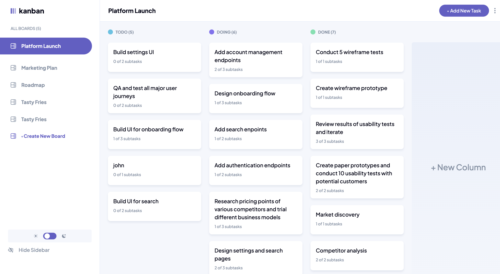

# Frontend Mentor - Kanban task management web app solution

This is a solution to the [Kanban task management web app challenge on Frontend Mentor](https://www.frontendmentor.io/challenges/kanban-task-management-web-app-wgQLt-HlbB). Frontend Mentor challenges help you improve your coding skills by building realistic projects.

## Table of contents

- [Overview](#overview)
  - [The challenge](#the-challenge)
  - [Screenshot](#screenshot)
  - [Links](#links)
- [My process](#my-process)
  - [Built with](#built-with)
  - [What I learned](#what-i-learned)
  - [Continued development](#continued-development)
  - [Useful resources](#useful-resources)
- [Author](#author)
- [Acknowledgments](#acknowledgments)

## Overview

### The challenge

Users should be able to:

- View the optimal layout for the app depending on their device's screen size
- See hover states for all interactive elements on the page
- Create, read, update, and delete boards and tasks
- Receive form validations when trying to create/edit boards and tasks
- Mark subtasks as complete and move tasks between columns
- Hide/show the board sidebar
- Toggle the theme between light/dark modes
- **Bonus**: Allow users to drag and drop tasks to change their status and re-order them in a column
- **Bonus**: Build this project as a full-stack application

### Screenshot



Add a screenshot of your solution. The easiest way to do this is to use Firefox to view your project, right-click the page and select "Take a Screenshot". You can choose either a full-height screenshot or a cropped one based on how long the page is. If it's very long, it might be best to crop it.

Alternatively, you can use a tool like [FireShot](https://getfireshot.com/) to take the screenshot. FireShot has a free option, so you don't need to purchase it.

Then crop/optimize/edit your image however you like, add it to your project, and update the file path in the image above.

### Links

- Solution URL: [https://github.com/mrvicthor/task-manager-app]
- Live Site URL: [https://task-manager-app-sandy-theta.vercel.app/]

## My process

### Built with

- Semantic HTML5 markup
- CSS custom properties
- Flexbox
- CSS Grid
- Mobile-first workflow
- [React](https://reactjs.org/) - JS library
- [Next.js](https://nextjs.org/) - React framework

### What I learned

I learned how to use server actions to mutate form data. For more advanced server-side validation, I used zod which is a library for validating the form fields before mutating the data.

Furthermore, I used useFormState which is a hook that allowed me to update the state based on the result of a form action.

I came across a tool (https://transform.tools/) that helped me convert svg into react components. Making it easy for me to style and work more efficiently with svg in Nextjs
To see how you can add code snippets, see below:

```js
import { z } from "zod";
import { useFormState } from "react-dom";

const schema = z.object({
  title: z.string().trim().min(3, { message: "title is required" }),
  description: z.optional(z.string()),
  subtasks: z.optional(z.array(Subtask)),
  status: z.enum(["Todo", "Doing", "Done"]).default("Done"),
});

const [state, formAction] = useFormState(
  taskData ? updateTaskWithId : createTaskWithId,
  {
    message: "",
  }
);
```

### Continued development

I plan to explore more about the revalidatePath function in nextJs. I struggled with revalidating data of a dynamic url with board Id.

### Useful resources

- [Zod](https://zod.dev/) - This helped me validate form fields before mutating data. I really liked this pattern and will use it going forward.
- [React useFormState](https://react.dev/reference/react/useActionState) - This allowed me to update state based on the result of a form action.

## Author

- Website - [Victor Eleanya](https://t.co/GyuJhbPKuM)
- Frontend Mentor - [@mrvicthor](https://www.frontendmentor.io/profile/mrvicthor)
- Twitter - [@eva_skillz](https://x.com/eva_skillz)

## Acknowledgments

I will like to thank my senior colleague Jude for making out time to review my code. It was quite insightful.
